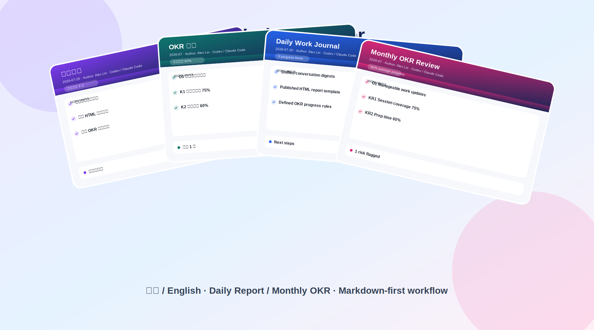
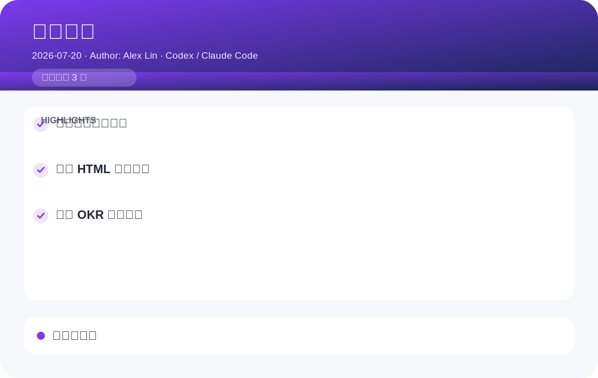
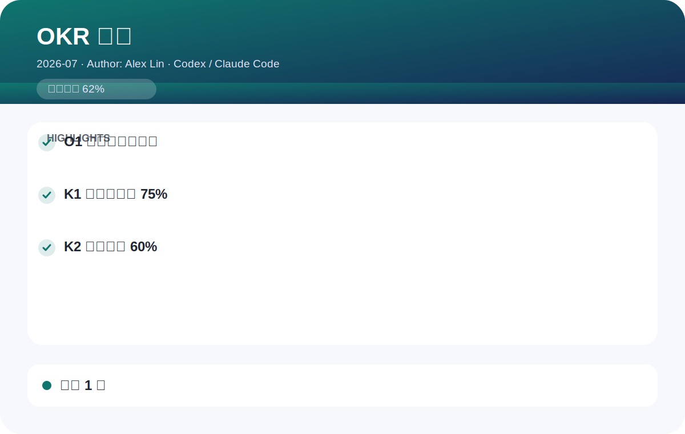
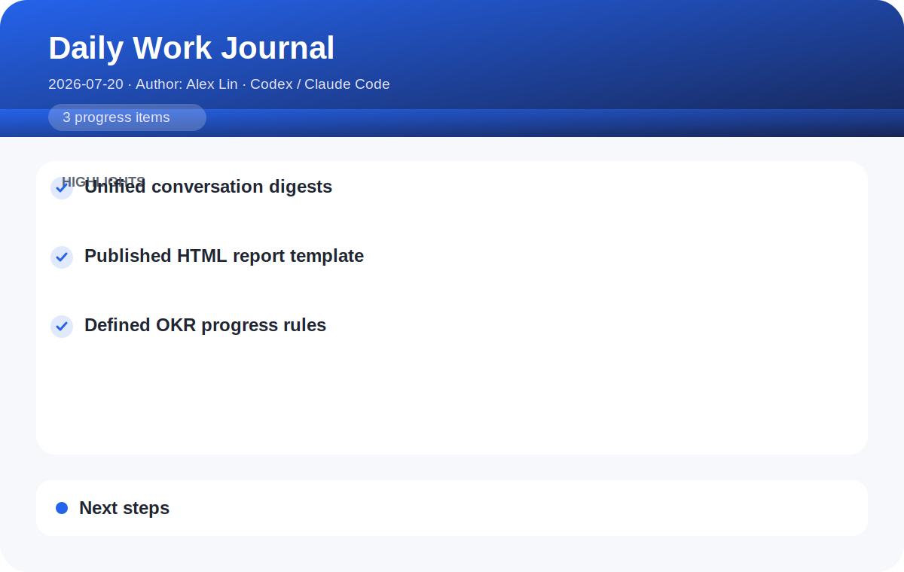
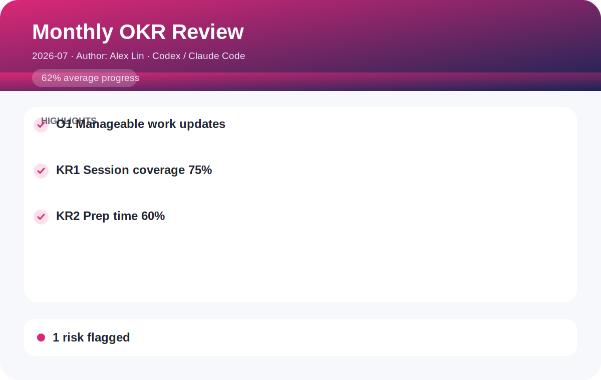

# Work Journaler（工作日志助手）

> 将本地 AI 编程对话沉淀成领导可直接阅读的工作日报和 OKR 月报：先 Markdown，用户确认后再生成精美 HTML。



## 能力概览

Work Journaler 会从 Claude Code、Qoder、Cursor、Copilot、Aone Copilot、Codex、Cline 和 OpenCode 的本地对话中提炼已验证的工作进展，并输出到 `~/work_journals`。

| 报告类型 | Markdown | HTML |
| --- | --- | --- |
| 工作日报 | `~/work_journals/daily/YYYY-MM-DD.md` | `~/work_journals/daily/YYYY-MM-DD.html` |
| OKR 月报 | `~/work_journals/monthly_okr/YYYY-MM.md` | `~/work_journals/monthly_okr/YYYY-MM.html` |

### 首次触发：确认输出语言

第一次触发技能时，会先识别触发请求所用的语言，并在开始抓取和撰写前请你确认。识别到的语言就是默认输出语言，也可以改选其他语言。确认结果会保存到 `~/work_journals/config.json` 的 `output_language` 字段，之后报告正文、标题、元信息、标签以及确认提示都会使用该语言。

```json
{"author":"林晓","output_language":"zh-CN"}
```

## 示例

`example/` 目录包含两份虚构但完整的 Markdown Demo，可直接用内置转换器生成 HTML：

```bash
python3 scripts/md_to_html.py example/daily-report-demo.md
python3 scripts/md_to_html.py example/monthly-okr-demo.md
```

| 日报 | OKR 月报 |
| --- | --- |
|  |  |
|  |  |

以上四张预览图分别展示中英文的日报和月报，并在顶部宣传图中以扇形叠放呈现；示例 Markdown 中的内容均为虚构 Demo。

## 工作流承诺

1. **基于事实。** 只从本地对话中提炼信息，不编造事实或数字。
2. **Markdown 优先。** 先写草稿并展示给你，等待确认。
3. **确认后才生成 HTML。** 未获确认不会输出最终的独立 HTML 报告。
4. **面向领导阅读。** 聚焦成果、价值、进度和风险，不罗列流水账。

## 甜度（含糖量）

可在请求中指定无糖、三分糖、半糖（默认）、七分糖或双份糖，用于控制表述的抽象程度与修辞浓度。糖分越高，表达越偏管理者视角；但无论何种甜度，都不允许编造事实。

完整触发方式、报告结构、数据源和渲染规则请见 [SKILL.md](SKILL.md)。
